[English](README_en.md)
# Swarm Learning v1.0 Community版をインストールしてみる
## 改訂履歴

| バージョン | 日付 | 改訂者 | 更新内容 |
| :---: | :---: | :---: | :---: |
| 0.1 | 2022.06.09 | [Taku Kimura @HPE Japan Presales](taku.kimura@hpe.com) | 初版(v1.0で検証) |
|  |  |  |  |
|  |  |  |  |

## はじめに
Swarm Learning v1.0 Community版をインストールしてみます。

## 用意した機材
- Virtual Machine 2台
  - Ubutu Server 20.04 
  - GUIインストーラーを使うのでUbuntu Desktop + XRDPインストール
  - Docker CEもインストール
  - GPUは用意できなかった・・・
- Network構成
  - Node01: 10.7.16.81/22
  - Node02: 10.7.16.82/22
  - インターネット接続可能


## 参考文書
- [HPE Swarm Learning User Guide](https://support.hpe.com/hpesc/public/docDisplay?docId=sd00001420en_us&docLocale=en_US&page=Introduction.html)
- [HPE Swarm Learning Installation and Configuration Guide](https://support.hpe.com/hpesc/public/docDisplay?docId=sd00001419en_us&docLocale=en_US&page=GUID-01199457-73B6-45F3-99FC-164E4B25A0A3.html)
- [HPE Swarm Learning Github](https://github.com/HewlettPackard/swarm-learning)

## セットアップ
### HPE AutoPass License Server(APLS)
#### Node01
まずライセンスを管理するAPLSサーバーを作ります。APLSのダウンロードは[My HPE Software Center](https://myenterpriselicense.hpe.com/cwp-ui/free-software/APLS)から可能です。Swarm Learning v0.3ではAPLSサーバーはコンテナイメージとして提供されていましたが、そのコンテナイメージが[My HPE Software Center](https://myenterpriselicense.hpe.com/cwp-ui/free-software/APLS)から配布していない様子?でしたので、Swarm Learning v0.3で使っていたAPLSコンテナイメージを転用します。

HPEのコンテナレジストリにログインします。passwordは[HPE Swarm Learning Github](https://github.com/HewlettPackard/swarm-learning)によると*hpe_eval*だそうです。

```bash
$ docker login hub.myenterpriselicense.hpe.com -u <HPE Software Centerで登録しているEmailアドレス> -p hpe_eval
```

APLSのコンテナイメージを取得します。

```bash
$ docker pull hub.myenterpriselicense.hpe.com/hpe_eval/swarm-learning/apls:0.3.0

$ docker images
REPOSITORY                                                     TAG       IMAGE ID       CREATED         SIZE
hub.myenterpriselicense.hpe.com/hpe_eval/swarm-learning/apls   0.3.0     8a382f3a48be   13 months ago   870MB
```

Docker-Composeをインストールします。

```bash
$ apt install python3-pip
$ pip install docker-compose
```

作業用ディレクトリと永続ボリューム領域を作成しときます。

```bash
$ mkdir work/sl_1.0/apls
$ cd work/sl_1.0/apls
$ mkdir -p data
```

docker-compose.yamlを作成します。

```yaml
version: '3'
services:
  apls:
    image: 'hub.myenterpriselicense.hpe.com/hpe_eval/swarm-learning/apls:0.3.0'
    network_mode: host
    restart: on-failure
    volumes:
      - './data:/opt/autopass/AutopassLicenseServer/data'
```

YAMLが完成したら、コンテナを立ち上げます。  
https://<node-hostname or IP>:5814にアクセスするとAPLSのログイン画面が見えてくると思います。初期ユーザー名/パスワードはadmin/passwordです。

```bash
$ docker-compose up -d
Creating apls_apls_1 ... done

$ docker ps
CONTAINER ID   IMAGE                                                                COMMAND                  CREATED         STATUS         PORTS     NAMES
358edfaf8934   hub.myenterpriselicense.hpe.com/hpe_eval/swarm-learning/apls:0.3.0   "/opt/autopass/Autop…"   7 seconds ago   Up 6 seconds             apls_apls_1
```

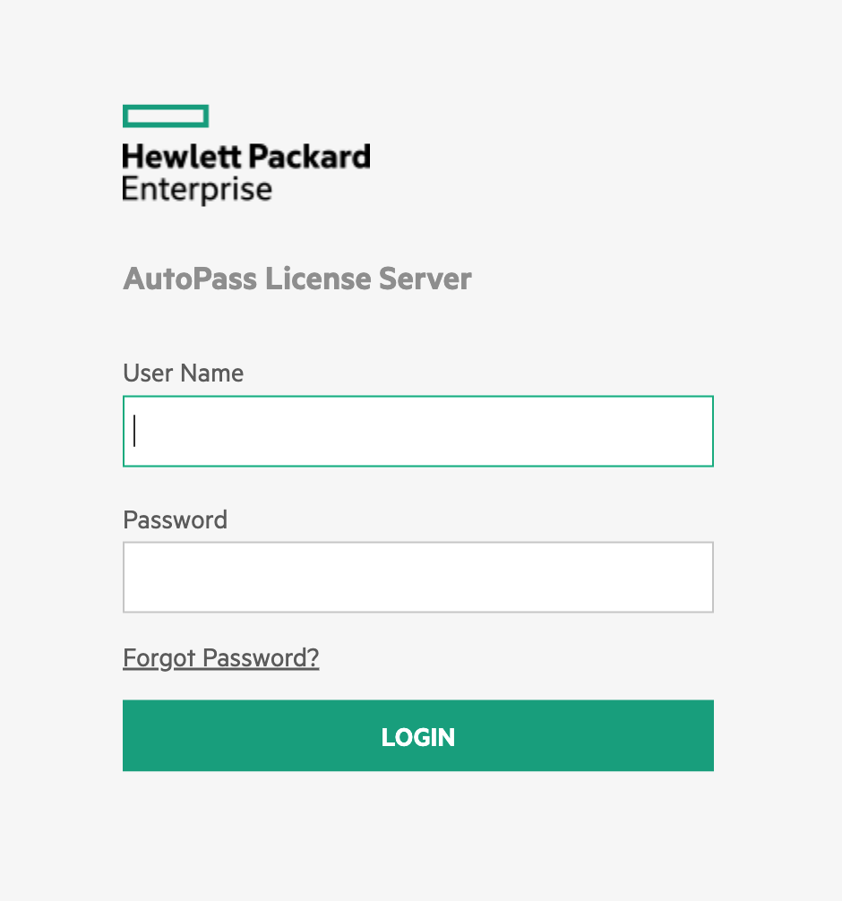

ログインするとパスワード変更を求められるので、適当なパスワードにします。

ライセンス登録をするため、[My HPE Software Center](https://myenterpriselicense.hpe.com)からSwarm Learningのライセンスを入手します。APLSサーバーにアクセスしてLicense Management > Install Licenseいくとロックコードなるものが表示されるので、Swarm Learningライセンスをダウンロード前に聞かれるシリアル番号欄にこのコードを入れてから、Dat形式のライセンスとその他コンポーネントをダウンロードしてください。この検証ではその他コンポーネントを*work/sl_1.0/sw*に置いています。

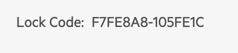

ダウンロード後、APLSサーバーにDatファイルをアップロードし、Nextを押します。ライセンス選択画面になったら全てのライセンスにチェックを入れてInstall Licensesボタンを押します。

APLSコンテナを削除してしまうとロックコードが変更されてしまうので、削除はしないでください。StopはOKです。

#### Node02
Node02も同じようにAPLSサーバーを立てます。

### インストーラー立ち上げ
#### Node01
ライセンスと同時にダウンロードしたインストーラーを立ち上げます。

```
$ cd work/sl_1.0/sw
$ chmod 755 HPE_SWARM_LEARNING_INSTALLER_LINUX_Q2V41-11036
$ ./HPE_SWARM_LEARNING_INSTALLER_LINUX_Q2V41-11036 
2022/06/10 07:48:12 HPE Swarm Learning installer is now listening at port 30302. Please open your browser and point to this address - http://localhost:30302
```
rdpでNode01にリモートデスクトップして、*http://localhost:30302*にブラウザアクセスします。

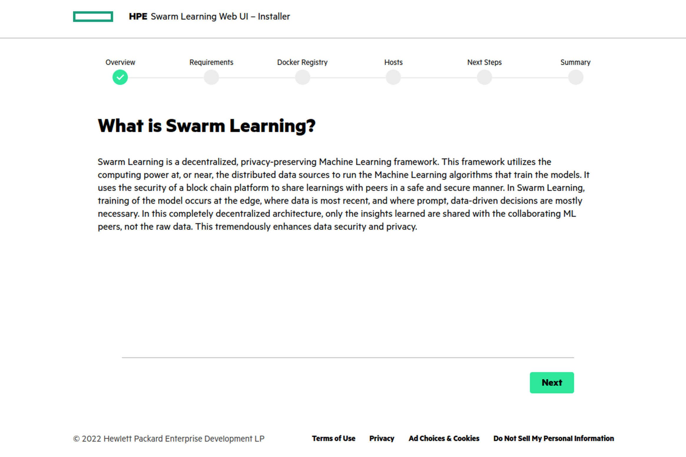
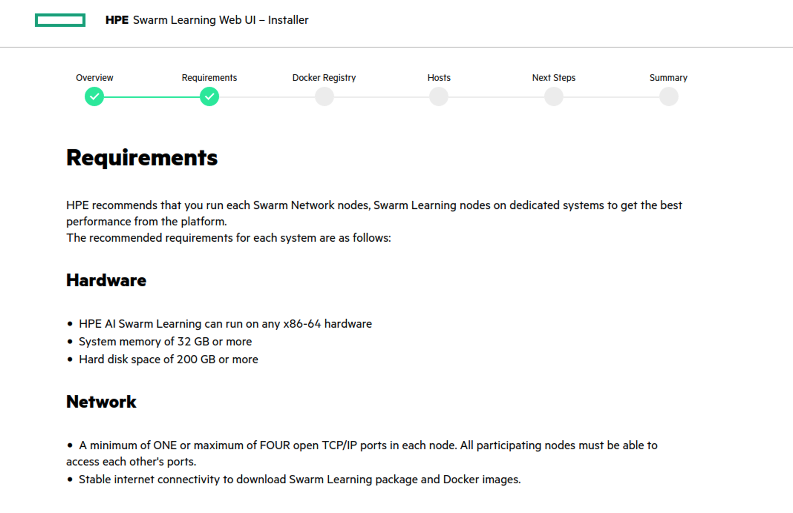
[My HPE Software Center](https://myenterpriselicense.hpe.com)のアカウント情報を入力します。
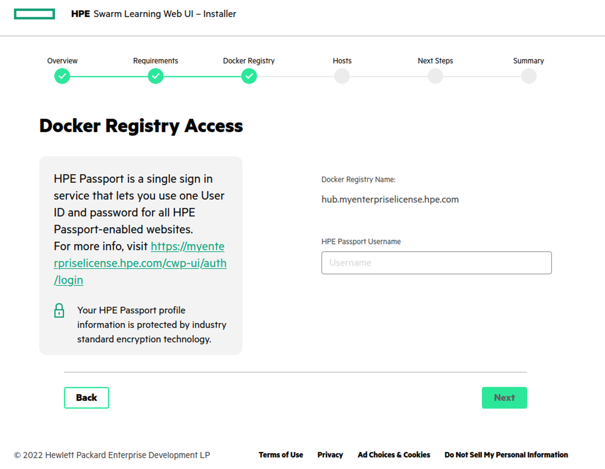
Node01のIPアドレスとsshログインするためのユーザー名とパスワードを入力します。本検証環境ではNode02も同じネットワークにいるので追加できますが、Node02は違う団体という体でやっているのであえて追加していません。
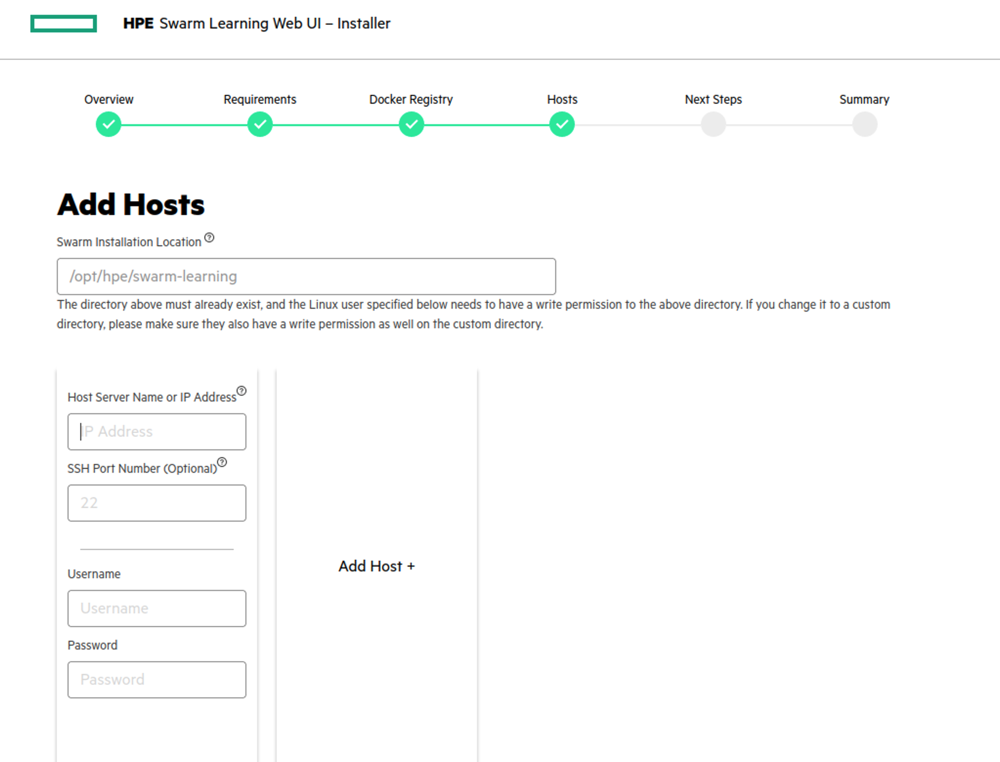
コンテナイメージ等をダウンロードし始めるので待ちます。
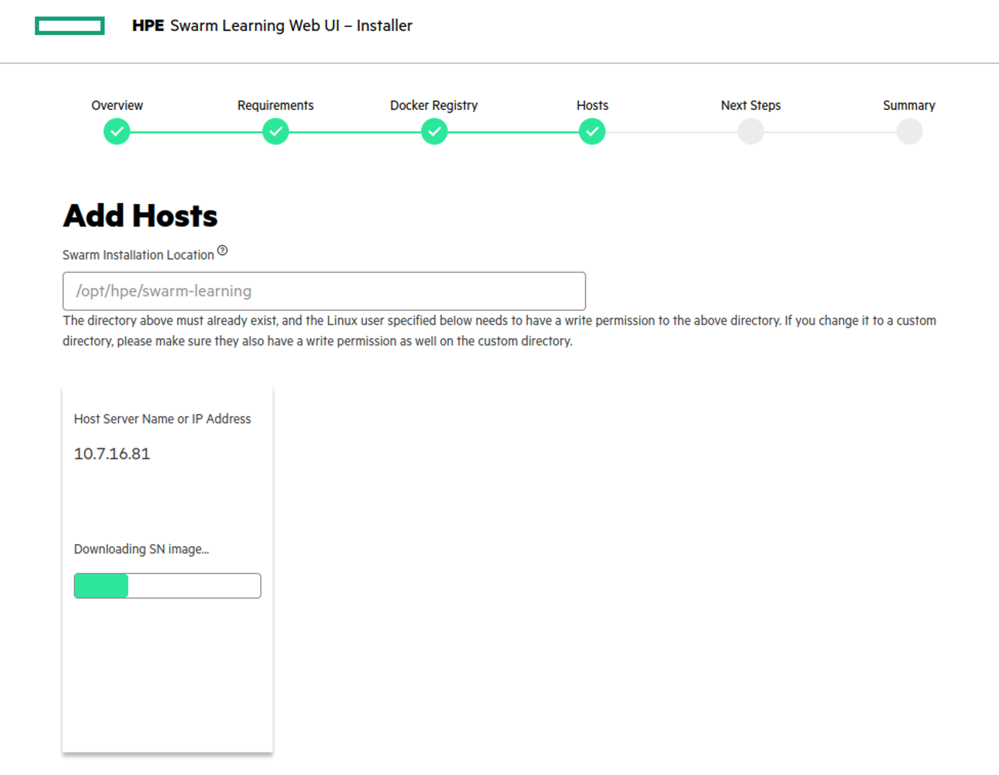
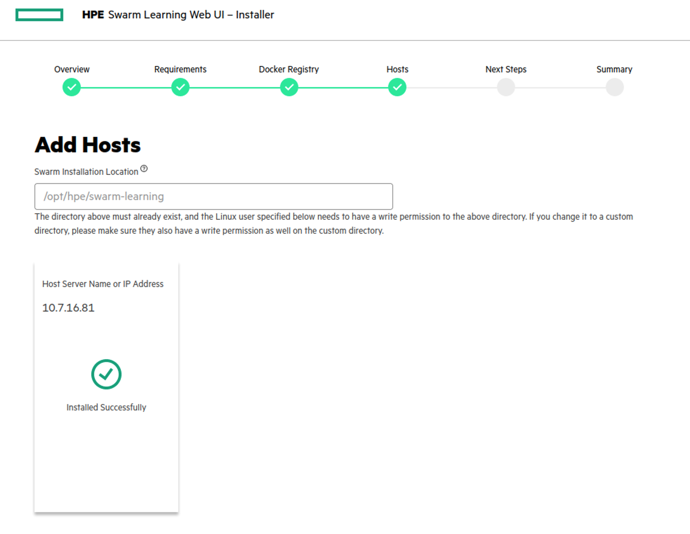
次のステップとしてAPLSサーバーのインストールが促されますが、既にやってしまっているので無視で大丈夫です。
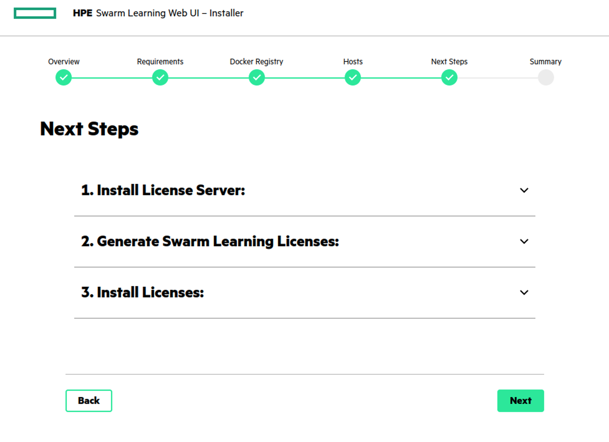
インストール完了です。CLIで起動させたインストーラーはCtrl + Cで終わらせます。
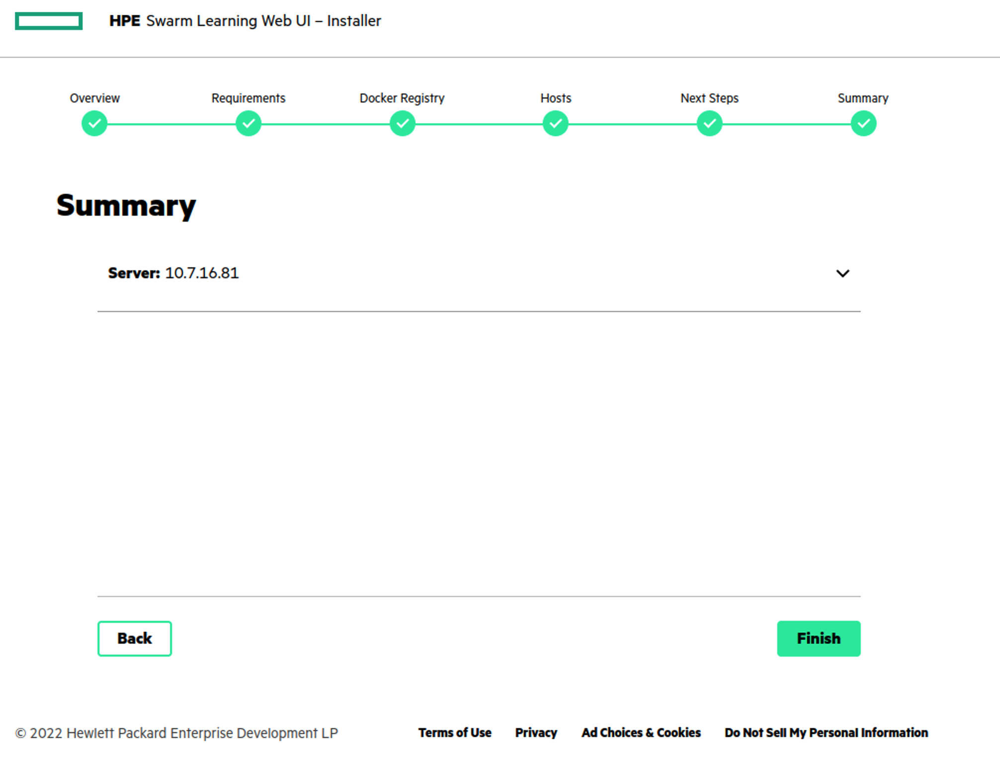

```bash
$ docker images
REPOSITORY                                                     TAG       IMAGE ID       CREATED         SIZE
hub.myenterpriselicense.hpe.com/hpe_eval/swarm-learning/sn     1.0.0     0fbeb1e14459   2 months ago    1.21GB
hub.myenterpriselicense.hpe.com/hpe_eval/swarm-learning/swci   1.0.0     3c76a7bb4f87   2 months ago    1.05GB
hub.myenterpriselicense.hpe.com/hpe_eval/swarm-learning/swop   1.0.0     f0d463e98f17   2 months ago    935MB
hub.myenterpriselicense.hpe.com/hpe_eval/swarm-learning/sl     1.0.0     d1c9f233521e   2 months ago    1.18GB
hub.myenterpriselicense.hpe.com/hpe_eval/swarm-learning/apls   0.3.0     8a382f3a48be   13 months ago   870MB

$ ls -la /opt/hpe/swarm-learning/lib
total 32
drwxr-xr-x 2 root root    68 Jun 10 07:52 .
drwxr-xr-x 3 root root    17 Jun 10 07:52 ..
-rw-r--r-- 1 root root 29250 Jun 10 07:52 swarmlearning-1.0.1-py3-none-manylinux_2_24_x86_64.whl
```

#### Node02
同様にインストーラーを立ち上げ、必要なコンポーネントをダウンロードします。

### Sentinel Node起動
#### Node01
Swarm Learning Network Node(SN Node)を起動します。最初に起動させるSN NodeはSentinel Nodeとなります。なぜか/opt/hpe/swarm-learning/binにスクリプトが置かれてないので、[HPE Swarm Learning Github](https://github.com/HewlettPackard/swarm-learning)から取ってきます。

```bash
$ cd work/sl_1.0
$ git clone https://github.com/HewlettPackard/swarm-learning.git
$ cp -pr  swarm-learning/scripts/bin /opt/hpe/swarm-learning/
```
証明書を作ります。この証明書を交換することで各ノードが相互に認証し合います。交換は後でやります。

```bash
$ swarm-learning/examples/utils/gen-cert -e node01 -i 1
$ cp -pr workspace/node01/cert /opt/hpe/swarm-learning/
```

コンテナで全てコンポーネントが起動するので、Swarm Learning用docker内部ネットワークも作っておきます。

```bash
root@k8s-worker01:~/work/sl_1.0# docker network create sl
ce8af084a5aca60e82ab4bc3c5283f4ed29ca2d2d2d3026db4c008510b238c0e
root@k8s-worker01:~/work/sl_1.0# docker network ls
NETWORK ID     NAME      DRIVER    SCOPE
10c25f49ce75   bridge    bridge    local
6dda532322fc   host      host      local
8e94f3a45fd1   none      null      local
ce8af084a5ac   sl        bridge    local
```

#### Node02
Node02でも同様に証明書を作ります。

```bash
$ cd work/sl_1.0
$ git clone https://github.com/HewlettPackard/swarm-learning.git
$ cp -pr  swarm-learning/scripts/bin /opt/hpe/swarm-learning/
$ swarm-learning/examples/utils/gen-cert -e node02 -i 2
$ cp -pr workspace/node02/cert /opt/hpe/swarm-learning/
```

Node01とNode02相互にCA証明書をコピーします。

```bash
[Node02]$ scp /opt/hpe/swarm-learning/cert/ca/capath/ca-2-cert.pem  <Node01>:/opt/hpe/swarm-learning/cert/ca/capath/

[Node01]$ scp /opt/hpe/swarm-learning/cert/ca/capath/ca-1-cert.pem  <Node02>:/opt/hpe/swarm-learning/cert/ca/capath/
```

Swarm Learning用Docker内部ネットワークを作成します。

```bash
$ docker network create sl
3b1878560aa48a7108f154dabf6f63334a83a5a02c03ab0b9d17768cc361073c
```
#### Node01/02
まず、Node01のSentinel SN Nodeを起動します。

```bash
node01$ /opt/hpe/swarm-learning/bin/run-sn --host-ip <Node01 IP> --sentinel --apls-ip <Node01 IP> --apls-port 5814 --sn-api-port 30304 --sn-p2p-port 30303 --key=/opt/hpe/swarm-learning/cert/sn-1-key.pem --cert=/opt/hpe/swarm-learning/cert/sn-1-cert.pem --capath=/opt/hpe/swarm-learning/cert/ca/capath --network sl
2f0ac2e9b4cc71055577918ba7a77339eb45879f84a9b71bd5c3ed136e75e33b

node01$  docker ps -a
CONTAINER ID   IMAGE                                                                COMMAND                  CREATED         STATUS         PORTS                                                                   NAMES
2f0ac2e9b4cc   hub.myenterpriselicense.hpe.com/hpe_eval/swarm-learning/sn:1.0.0     "/usr/bin/python3 -c…"   3 seconds ago   Up 2 seconds   0.0.0.0:30303-30304->30303-30304/tcp, :::30303-30304->30303-30304/tcp   exciting_curie
af0c7b86b814   hub.myenterpriselicense.hpe.com/hpe_eval/swarm-learning/apls:0.3.0   "/opt/autopass/Autop…"   7 minutes ago   Up 7 minutes                                                                           apls_apls_1

node01$  docker logs 2f -f
######################################################################
##                    HPE SWARM LEARNING SN NODE                    ##
######################################################################
## © Copyright 2019-2022 Hewlett Packard Enterprise Development LP  ##
######################################################################
2022-06-10 00:48:33,734 : swarm.blCnt : INFO : Setting up blockchain layer for the swarm node: START
2022-06-10 00:48:34,974 : swarm.blCnt : INFO : Creating Autopass License Provider
2022-06-10 00:48:35,701 : swarm.blCnt : INFO : Creating license server
2022-06-10 00:48:35,702 : swarm.blCnt : INFO : Setting license servers
2022-06-10 00:48:35,716 : swarm.blCnt : INFO : Acquiring floating license 1100000380:1
2022-06-10 00:48:36,644 : swarm.blCnt : INFO : SENTINEL_NODE_IP environment variable is not set
2022-06-10 00:48:38,599 : swarm.SN : INFO : SMLETHNode: Starting GETH ... 
2022-06-10 00:48:48,638 : swarm.SN : WARNING : SMLETHNode: Enode list is empty: Node is standalone
2022-06-10 00:50:12,055 : swarm.SN : INFO : SMLETHNode: Started I-am-Alive thread
2022-06-10 00:50:12,056 : swarm.blCnt : INFO : Setting up blockchain layer for the swarm node: FINISHED
2022-06-10 00:50:12,850 : swarm.blCnt : INFO : Starting SWARM-API-SERVER on port: 30304
```
APIサーバーがStartingになったことを確認してから、Node02のSN Nodeを起動します。

```bash
node02$ /opt/hpe/swarm-learning/bin/run-sn --host-ip <Node02 IP> --sentinel-ip <Node01 IP>  --apls-ip <Node02 IP> --apls-port 5814 --sn-api-port 30304 --sn-p2p-port 30303 --key=/opt/hpe/swarm-learning/cert/sn-2-key.pem --cert=/opt/hpe/swarm-learning/cert/sn-2-cert.pem --capath=/opt/hpe/swarm-learning/cert/ca/capath --network sl
1b34e09ee44c72960fe70734f95444c1f0ffc876eda2e1847f3a7e4b1c4d85a7

node02$  docker logs -f 1b
######################################################################
##                    HPE SWARM LEARNING SN NODE                    ##
######################################################################
## © Copyright 2019-2022 Hewlett Packard Enterprise Development LP  ##
######################################################################
2022-06-10 01:24:18,501 : swarm.blCnt : INFO : Setting up blockchain layer for the swarm node: START
2022-06-10 01:24:19,616 : swarm.blCnt : INFO : Creating Autopass License Provider
2022-06-10 01:24:20,350 : swarm.blCnt : INFO : Creating license server
2022-06-10 01:24:20,351 : swarm.blCnt : INFO : Setting license servers
2022-06-10 01:24:20,363 : swarm.blCnt : INFO : Acquiring floating license 1100000380:1
2022-06-10 01:24:20,928 : swarm.SN : INFO : Using URL : https://10.7.16.81:30304/is_up
2022-06-10 01:24:20,959 : swarm.SN : INFO : Sentinel Node is UP!
2022-06-10 01:24:21,073 : swarm.SN : INFO : SMLETHNode: Starting GETH ... 
2022-06-10 01:24:46,174 : swarm.SN : INFO : SMLETHNode: Started I-am-Alive thread
2022-06-10 01:24:46,175 : swarm.blCnt : INFO : Setting up blockchain layer for the swarm node: FINISHED
2022-06-10 01:24:46,986 : swarm.blCnt : INFO : Starting SWARM-API-SERVER on port: 30304

```
Node01, Node02共にAPLSにログインするとSNライセンスが１つ使われていることがわかります。
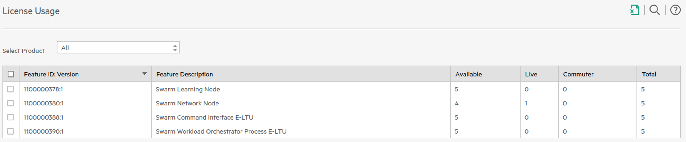


### Swarm Operator Node(SWOP)
#### Node01
[Github](https://github.com/HewlettPackard/swarm-learning)のmnistの例を使ってみます。git cloneは既に済んでいるので、mnistのディレクトリを確認します。

```bash
$ cd work
$ tree sl_1.0/swarm-learning/examples/mnist
├── MNIST.md
├── app-data
│   └── Mnist-npz.md
├── model
│   └── mnist_tf.py
├── swci
│   ├── swci-init
│   └── taskdefs
│       ├── swarm_mnist_task.yaml
│       └── user_env_tf_build_task.yaml
└── swop
    ├── swop1_profile.yaml
    └── swop2_profile.yaml
```
証明書を作った際に**work/sl_1.0/workspace**というディレクトリができていると思います。**work/sl_1.0/workspace/mnist**というディレクトリを作成して、このディレクトリをワークスペースとします。SWOP用の設定ファイルを置くため、**work/sl_1.0/workspace/mnist/swop**というディレクトリを作成して、[Github](https://github.com/HewlettPackard/swarm-learning)のmnist exampleの*swop1_profile.yaml*をコピーします。

```bash
$ cd work
$ mkdir -p sl_1.0/workspace/mnist/swop
$ cp sl_1.0/swarm-learning/examples/mnist/swop/swop1_profile.yaml sl_1.0/workspace/mnist/swop/
```

*swop1_profile.yaml*をNode01用に書き換えます。

```yaml
---
#  sl_1.0/workspace/mnist/swop/swop1_profile.yaml
######################################################################
# (C)Copyright 2021,2022 Hewlett Packard Enterprise Development LP
######################################################################
groupname  : demo
taskrunner : defaulttaskbb.taskdb.sml.hpe
policyuri  : ~
resourcemgr :
    mgrtype    : DOCKER
    accessinfo :
        accesstype : FROMENV
# Docker内部ネットワークを書き換え
network    : sl
apls :
    locator :
        # Node01のIPアドレスとPort:5814に書き換え
        host : 10.7.16.81
        port : 5814
apisrv :
    locator :
        # Node01のIPアドレスとPort:30304に書き換え
        host : 10.7.16.81
        port : 30304
envvars :
    # なんとなく挙動を確認したいのでDEBUGに書き換え
    - SL_LOG_LEVEL : DEBUG
    - http_proxy : ~
    - https_proxy : ~
    - no_proxy : ~
    - HTTP_PROXY : ~
    - HTTPS_PROXY : ~
    - NO_PROXY : ~
nodes :
    - slnodedef :
        idx : 0
        identity :
            - attribute :
                aType : KEY
                mType : BIND
                # 秘密鍵のパス
                src : "/opt/hpe/swarm-learning/cert/sn-1-key.pem"
                tgt : "/opt/hpe/swarm-learning/cert/sn-1-key.pem"
                subPath : null
            - attribute :
                aType : CERT
                mType : BIND
                # 公開鍵のパス
                src : "/opt/hpe/swarm-learning/cert/sn-1-cert.pem"
                tgt : "/opt/hpe/swarm-learning/cert/sn-1-cert.pem"
                subPath : null
            - attribute :
                aType : CAPATH
                mType : BIND
                # CA証明書のパス
                src : "/opt/hpe/swarm-learning/cert/ca/capath"
                tgt : "/opt/hpe/swarm-learning/cert/ca/capath"
                subPath : null
        # Node名へ書き換え
        slhostname : node01
        # Node01のIPアドレスに書き換え
        slhostip   : 10.7.16.81
        slport : 16000
        usrhostname : user1
        privatedata :
            # workspaceのapp-dataディレクトリに書き換え(ディレクトリは後で作る)
            src: "/root/work/sl_1.0/swarm-learning/examples/mnist/swop/swop1_profile.yaml sl_1.0/workspace/mnist/app-data"
            mType : BIND
        slenvvars : null
        usrenvvars : null
```

**app-data**ディレクトリを作っておきます。

```bash
$ mkdir -p sl_1.0/workspace/mnist/app-data
```

