# vSphere with Tanzu / Tanzu K8s Grid Service Installation
NVAIEの基盤の下地を作るため、
vSphere with Tanzuの環境を作っていきます。

## 改訂履歴

| バージョン | 日付 | 改訂者 |
| :---: | :---: | :---: |
| 0.1 | 2022.9.16 | [Yoshihiko Katayama @HPE Japan Presales](yoshihiko.katayama@hpe.com) |
|  |  |  |

## NVAIE対応のTanzu整理
NVIDIA AI Enterpriseに対応しているTanzu製品を整理します。

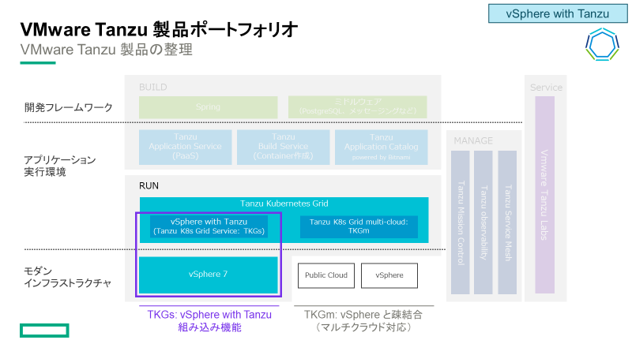

Tanzu製品は大きく分けて、vSphere依存する"**vSphere with Tanzu**"と、
インフラ依存しない"**Tanzu Kubernetes Grid Multi-Cloud(TKGm)**"の2種類あります。 
さらにvSphere with Tanzuの中には、vSphere上で直接K8s Podを稼働させる"**vSphere Pod**"と、 
仮想マシン環境としてCNCF準拠したK8s Clusterを提供する"**Tanzu Kubernetes Grid Service(TKGs)**"があります。 
現時点では、GPU SupportおよびNVAIE SupportしているTanzu製品は"**Tanzu Kubernetes Grid Service(TKGs)**"のみとなります。

最新の対応状況はこちらをご参照ください。 
[VMware Tanzu Kubernetes Grid Now Supports GPUs Across Clouds](https://tanzu.vmware.com/content/blog/tanzu-kubernetes-grid-supports-gpus-across-clouds) 
[NVIDIA AI Enterprise Release Notes](https://docs.nvidia.com/ai-enterprise/latest/release-notes/index.html) 
[Deploy an AI-Ready Enterprise Platform on VMware vSphere 7 with VMware Tanzu Kubernetes Grid Service](https://core.vmware.com/resource/deploy-ai-ready-enterprise-platform-vmware-vsphere-7-vmware-tanzu-kubernetes-grid-service#overview)

## vSphere with Tanzu システム要件

#### 参考ドキュメント
[vSphere with Tanzuの設定と管理](https://docs.vmware.com/jp/VMware-vSphere/7.0/vmware-vsphere-with-tanzu/GUID-152BE7D2-E227-4DAA-B527-557B564D9718.html) 
[vSphere with Tanzu Quick Start Guide V1a](https://core.vmware.com/resource/vsphere-tanzu-quick-start-guide-v1a#_Toc53677530) 
[vSphere クラスタで vSphere with Tanzu を構成するための前提条件](https://docs.vmware.com/jp/VMware-vSphere/7.0/vmware-vsphere-with-tanzu/GUID-EE236215-DA4D-4579-8BEB-A693D1882C77.html) 
[Tanzu Kubernetes Gird サービス v1alpha2 APIを使用するための要件](https://docs.vmware.com/jp/VMware-vSphere/7.0/vmware-vsphere-with-tanzu/GUID-0CA8BF39-0D7E-4335-9D5B-7C80ED90D4D8.html) 
[HAProxyロードバランサで使用するスーパーバイザークラスタのvSphere Distributed Switchの作成](https://docs.vmware.com/jp/VMware-vSphere/7.0/vmware-vsphere-with-tanzu/GUID-A3EEF5E4-3FAB-4193-B924-5579716D112A.html#GUID-A3EEF5E4-3FAB-4193-B924-5579716D112A) 

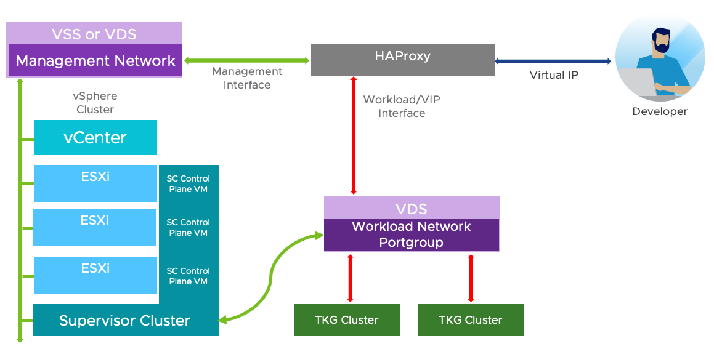
システム要件：
- 3台以上のESXiホスト
- vSANはMustではない
- ネットワークはNSX-T構成と、vDS+HAProxyの2パターン

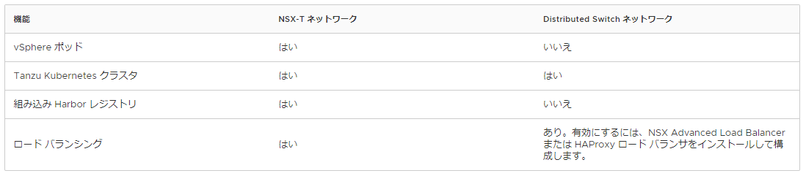
一番手っ取り早いのはNSX-Tを使わず、vDS + HAProxy環境下でのTKGsのため、今回はこちらを採用します。

## TKGs構築① - vDS作成　
vDSを作成していきます。

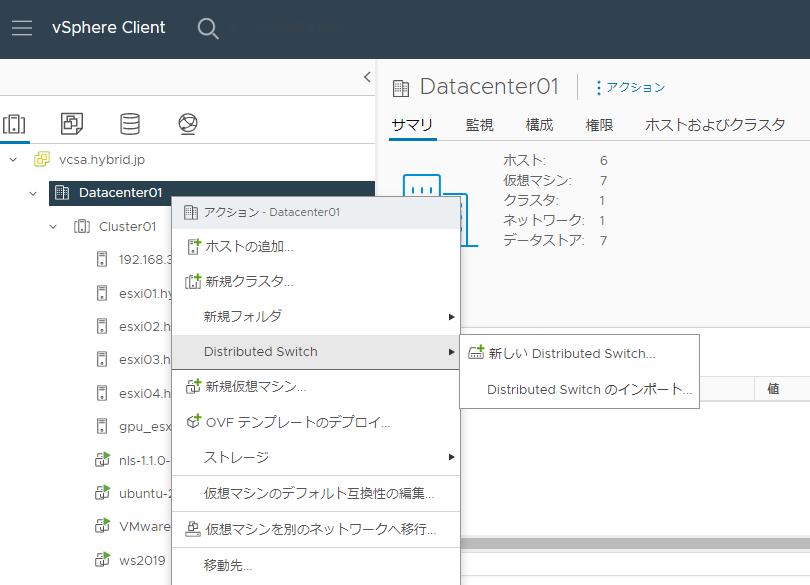
”DataCenter" > "Distributed Switch"

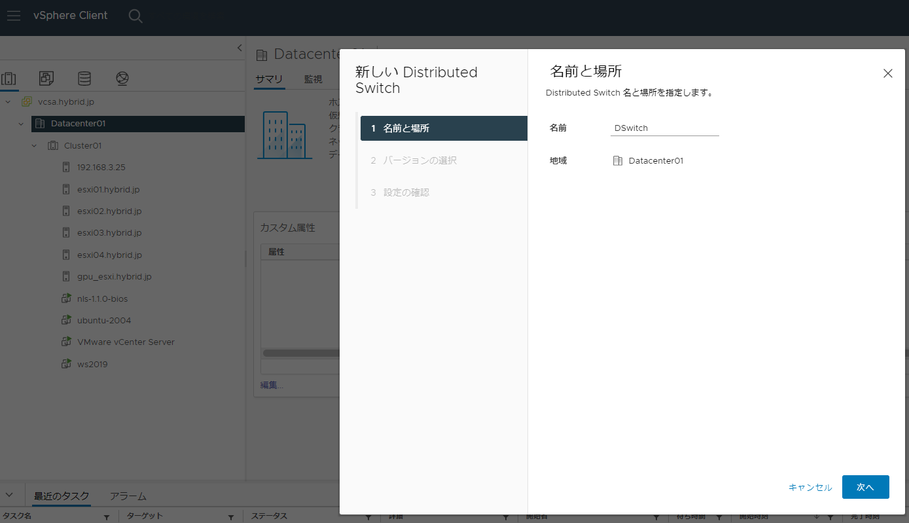
vDSの名前、配置場所を入力、設定

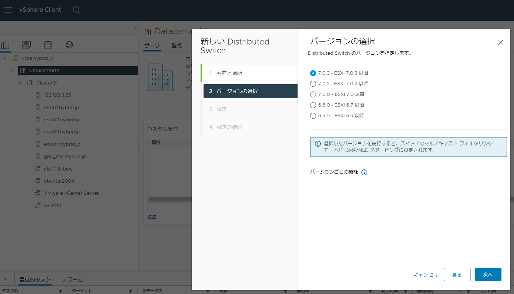
バージョンの選択

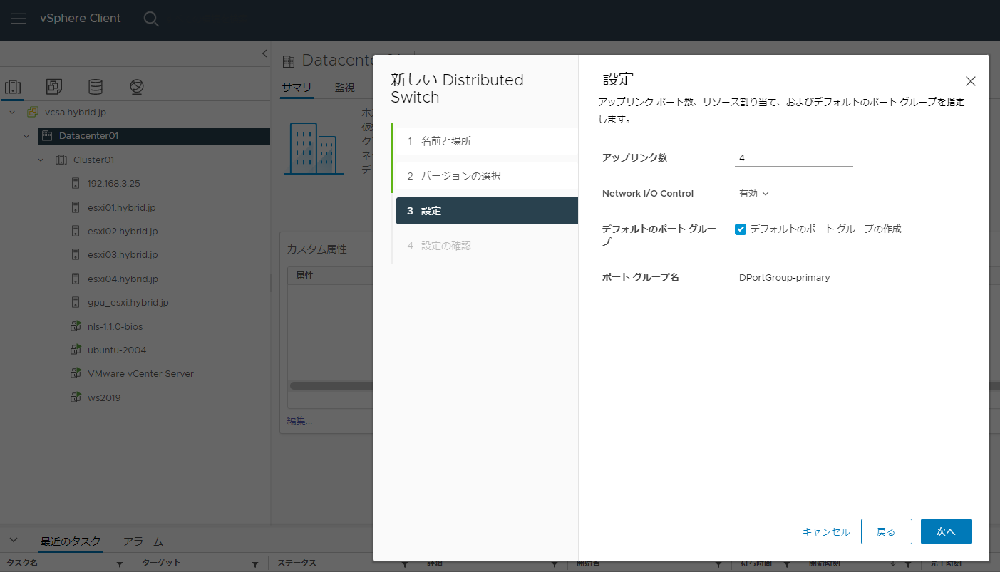
ポートグループ情報等記載。
このPrimaryポートグループはスーパーバイザークラスタのプライマリワークロードネットワーク（K8s制御プレーン仮想マシントラフィックの処理）として利用します。

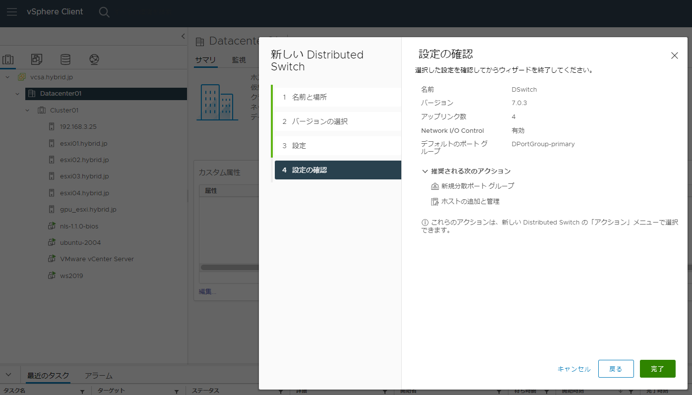 
設定の確認

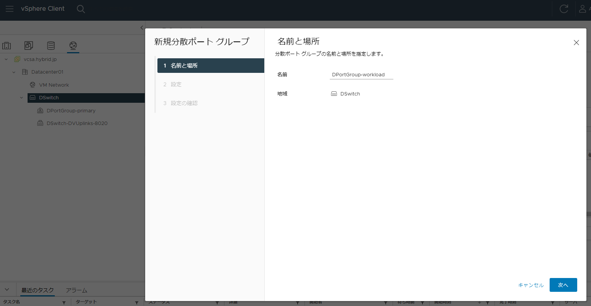
作成した”分散仮想スイッチ”に移動し、右クリック。
"分散ポートグループ" > "新規分散ポートグループ"を選択します。

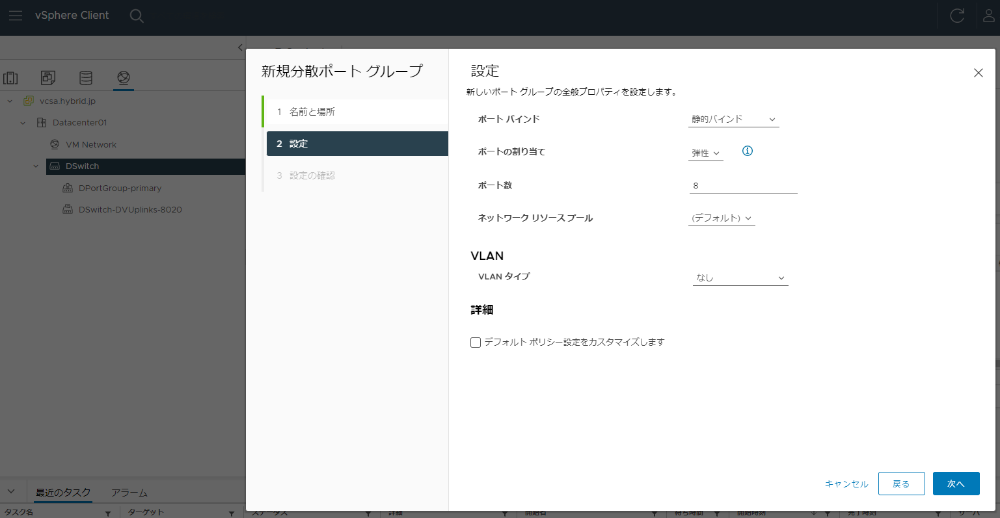
今回はデフォルトの設定で作成します。

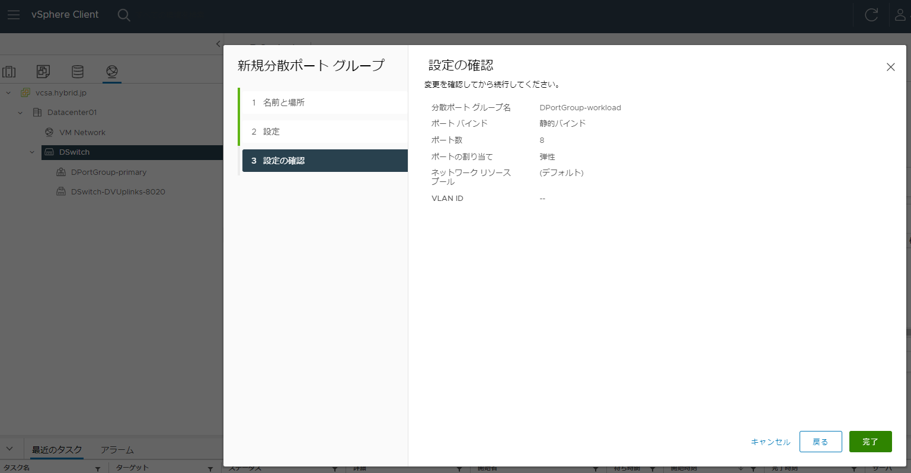
今回はすべてのK8s名前空間用のネットワークを一つの分散ポートグループで実施する想定で1つのみ作成しておりますが、名前空間毎にネットワークを隔離したい場合は、ポートグループを複数作成して実施することも可能です。

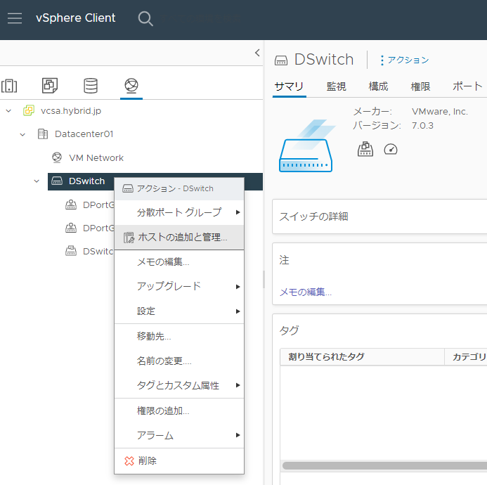
スーパーバイザークラスターとして構成するvSphereクラスタのホストをvDSに追加します。
vDSを右クリック、"ホストの追加と管理"を選択します。

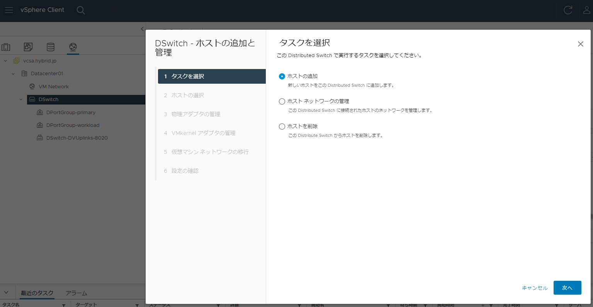
”ホストの追加”を選択

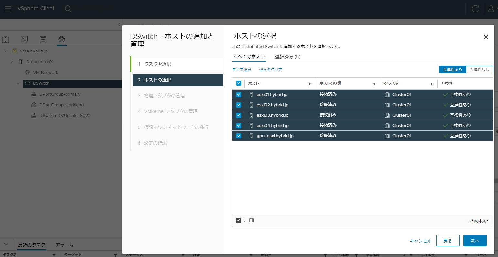
追加するホストを選択

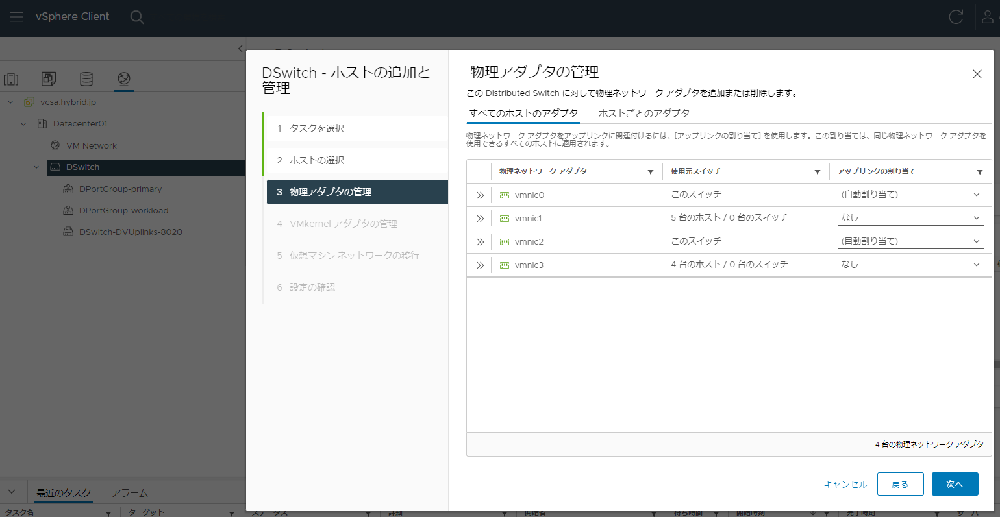
各ホストから物理NICを選択し、vDS上のアップリンクに割り当てる

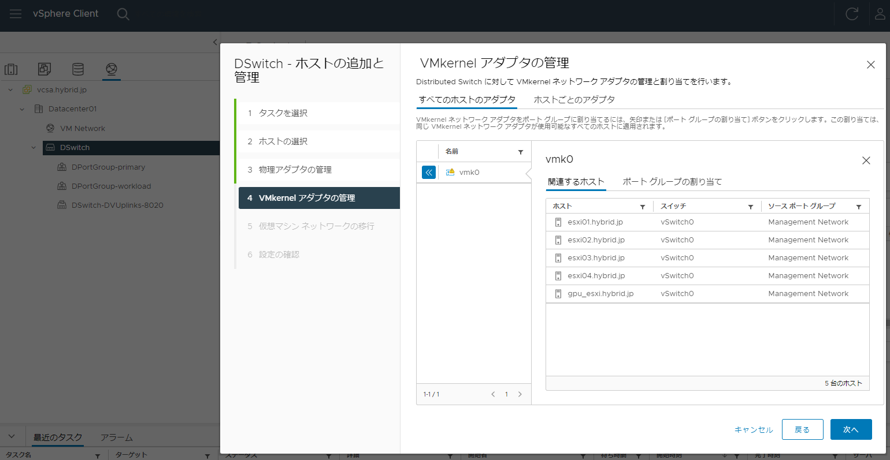

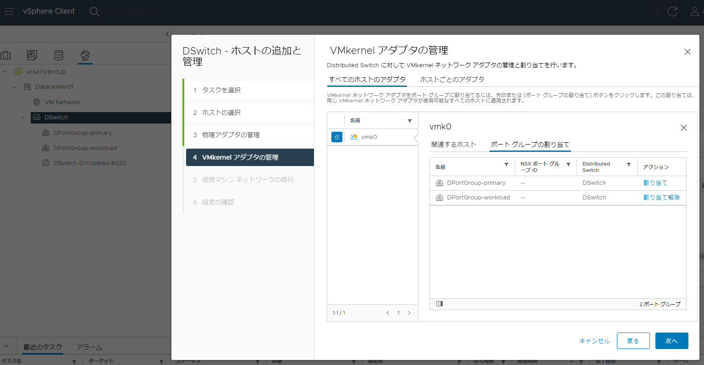

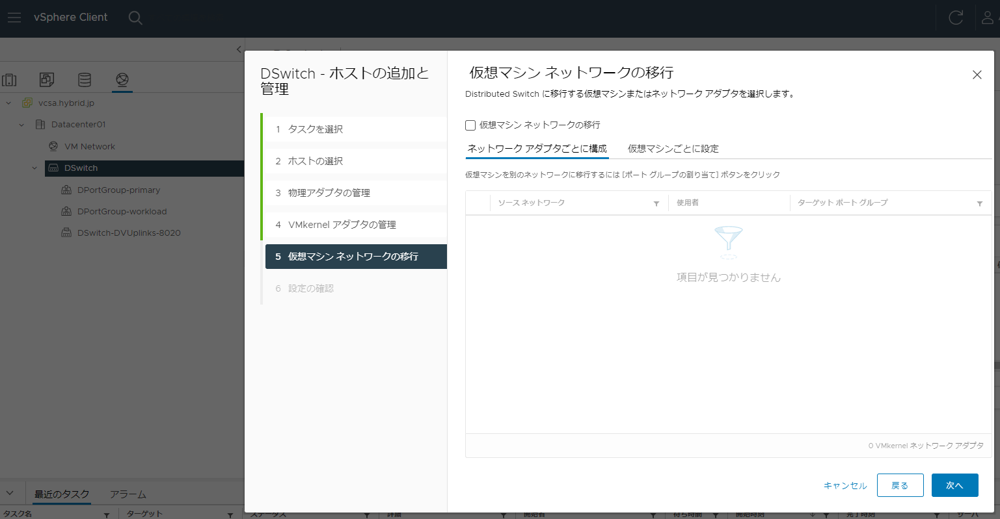
特に移行するものがなければ次に進める

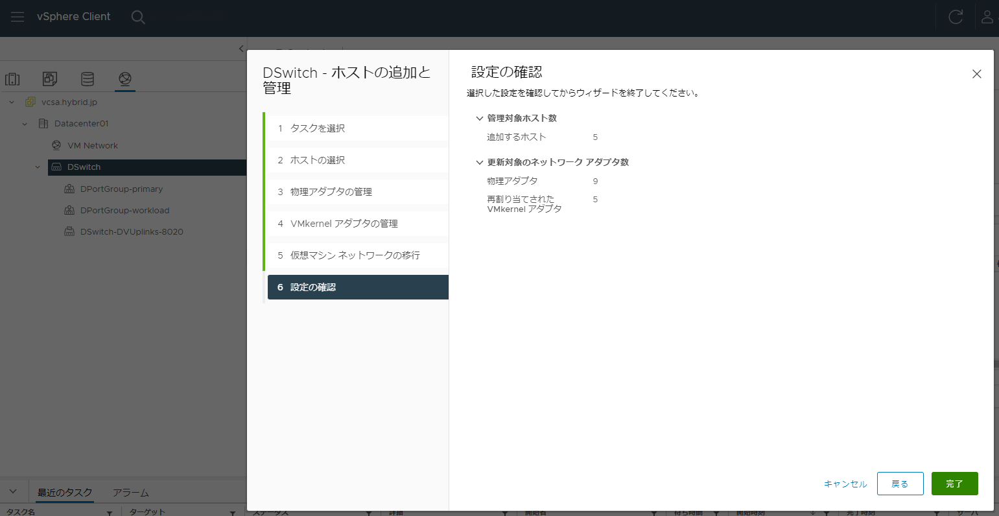

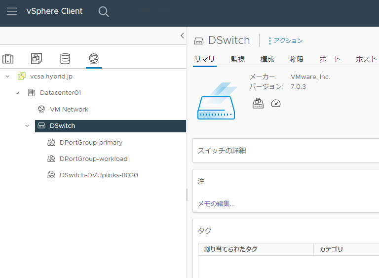

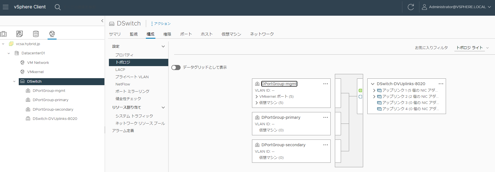
