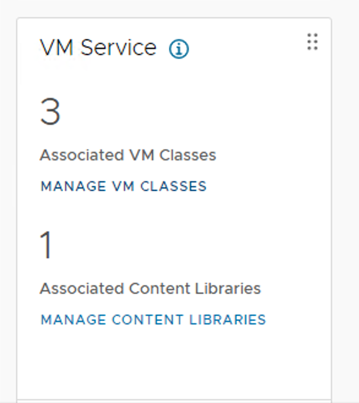
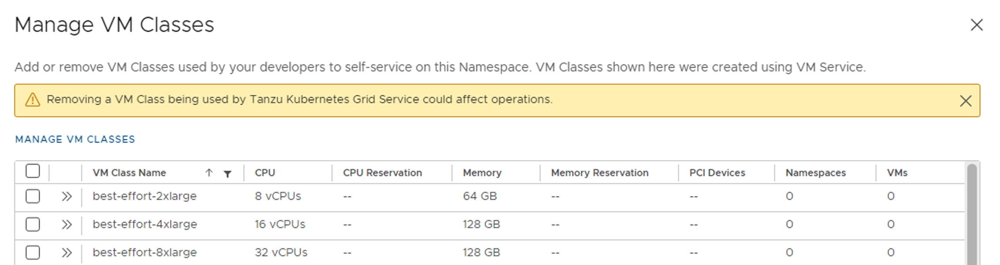
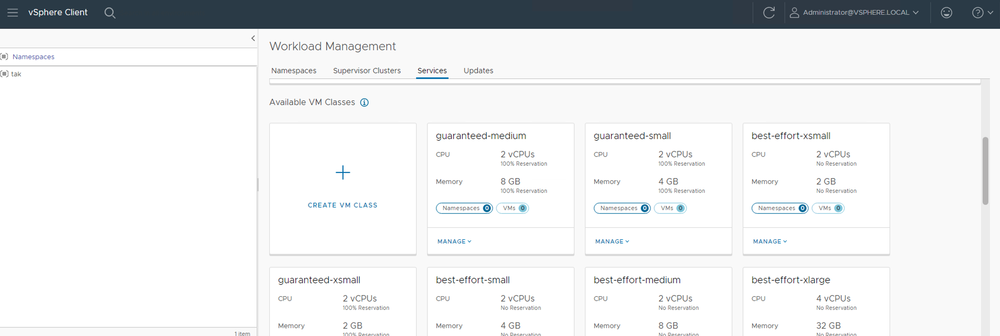
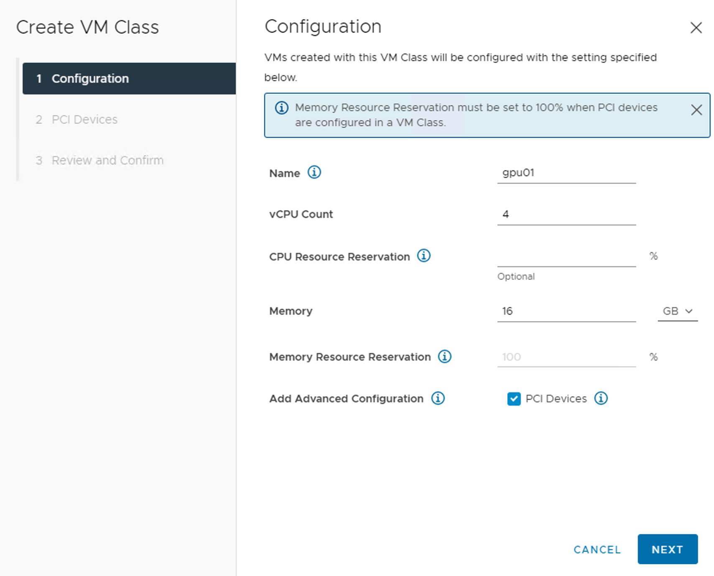
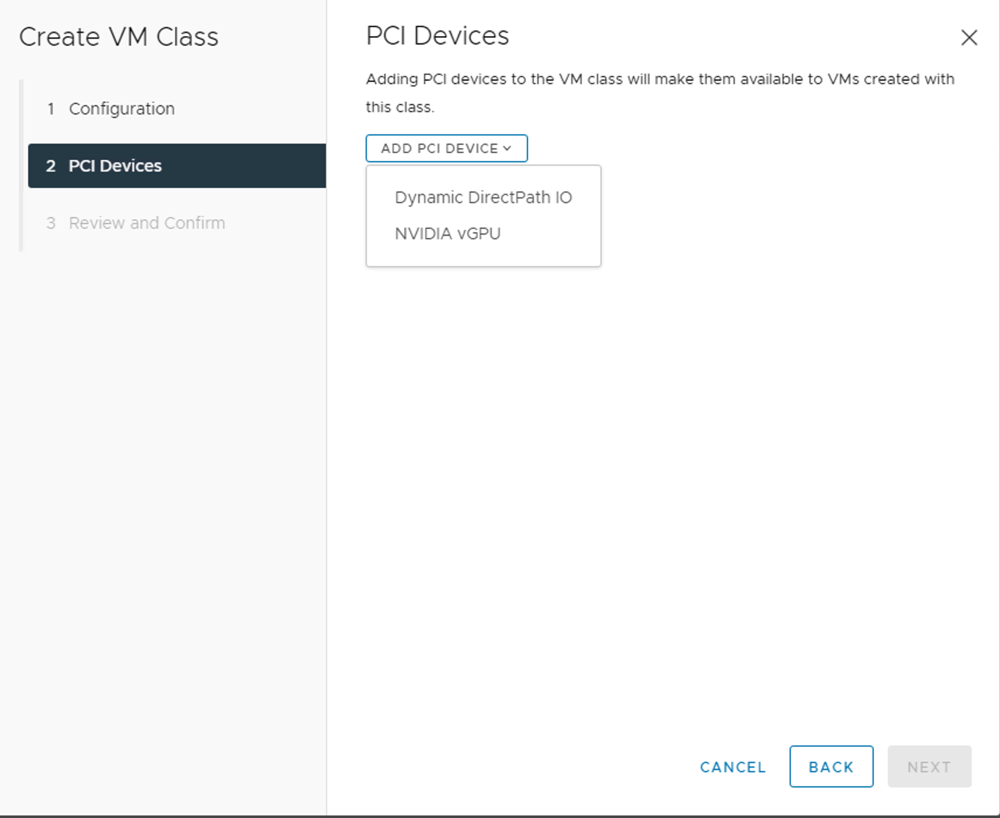
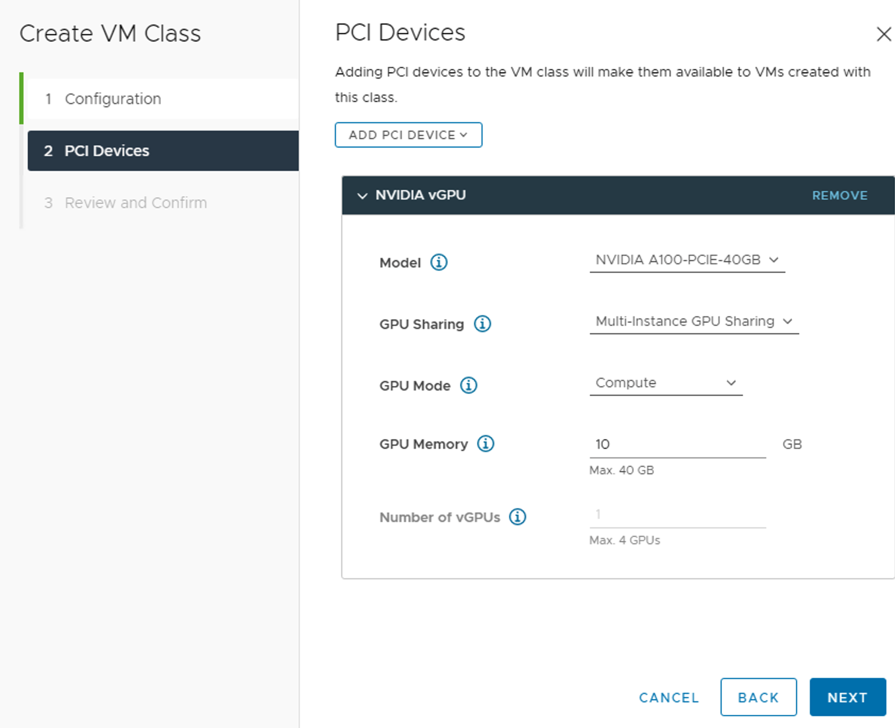
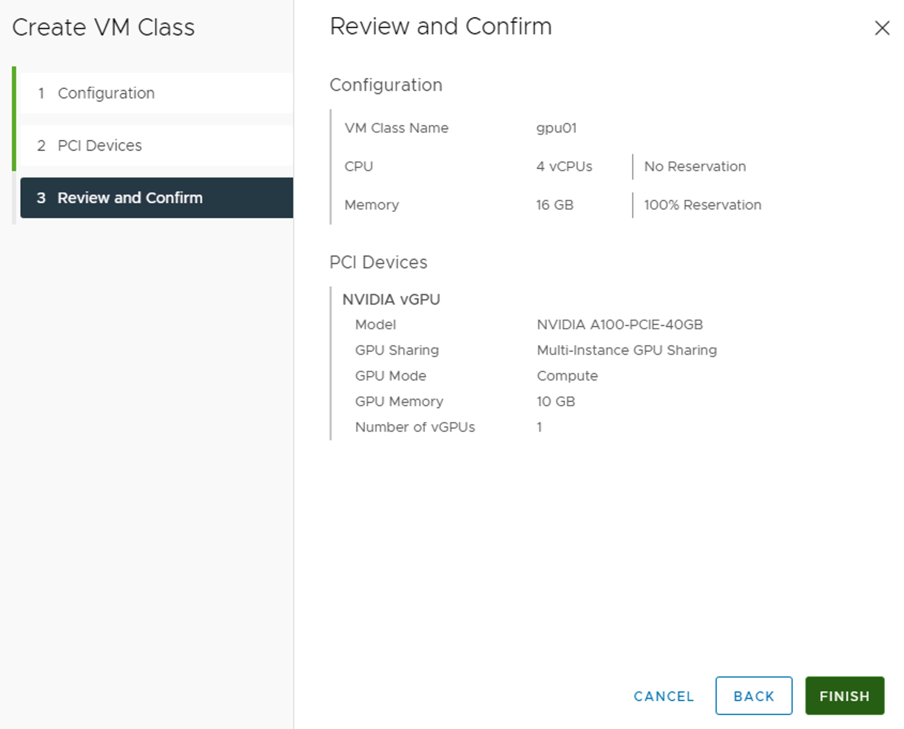
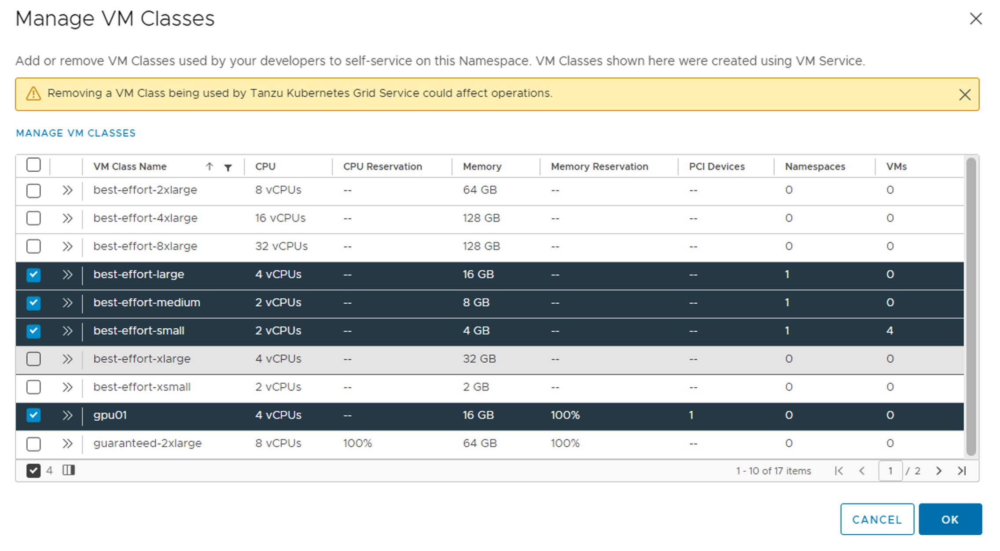

# Nvidia AI Enterprise環境でk8sクラスタにGPUをアサインしてみる
## 改訂履歴

| バージョン | 日付 | 改訂者 | 更新内容 |
| :---: | :---: | :---: | :---: |
| 0.1 | 2022.8.10 | [Taku Kimura @HPE Japan Presales](taku.kimura@hpe.com) | 初版 |
|  |  |  |  |
|  |  |  |  |
|  |  |  |  |

## 検証バージョン
- vSphere 7.0U3
- vCenter 7.0.3
- Nvidia A100 40G

## 前提
- TKGSの初期セットアップが完了していること
- Nvidia AI Enterprise環境の初期セットアップが完了していること
- TKGS Supervisor Clusterの作成が完了していること
- Namespaceのセットアップが完了していること
- クライアントPCにKubectlとKubectl Vsphere Pluginがインストール済みであること
- クライアントPCにHELMがインストール済みであること
- Contents Libraryの設定が完了していること

## 手順
### GPUが付与されたVM Class作成
本検証環境で事前に用意されている*tak*のNamespace内にGPUが付与されているVM Classを作成します。

*Manage VM Classes*を選択します。


さらに、*Manage VM Classes*を選択します。



*CREATE VM CLASS*を選択します。


ナビゲーションに従い、必要な値を入力します。*PCI Devices*のチェックを有効にすることを忘れないでください。


PCI Deviceとして*Nvidia vGPU*を選択します。


A100なので*MIG*を選択してみます。


設定値が間違っていないことを確認して*Finish*ボタンを押します。


作成した*gpu01*というVM ClassをNamespaceにアサインします。


### GPU用のイメージ取得
[こちらのシステム要件](https://docs.vmware.com/jp/VMware-vSphere/7.0/vmware-vsphere-with-tanzu/GUID-9A458012-B6A8-4A8B-9052-23D9FD164420.html#GUID-9A458012-B6A8-4A8B-9052-23D9FD164420__section_i1b_25g_crb)に書いてある通り、GPUを持たせるノードには特定のイメージを持たせる必要があります。事前にコンテンツライブラリに配置しておく必要があります。今回は*ob-18691651-tkgs-ova-ubuntu-2004-v1.20.8---vmware.1-tkg.2*のイメージ使用しています。

### k8sクラスタ作成用マニュフェスト
GPUリソースを持ったk8sクラスタを作成してみます。

先ほど作成した、GPUを持ったVM ClassがSupervisor Clusterから正常に見えるか確認します。

```bash
$ k get vmclass
NAME                 CPU   MEMORY   AGE
best-effort-large    4     16Gi     10d
best-effort-medium   2     8Gi      10d
best-effort-small    2     4Gi      10d
gpu01                4     16Gi     28s
```

次にk8sクラスタ作成用のマニフェストを用意します。ファイル名は**tkg-gpu-cluster01**とします。

```yaml
---
apiVersion: run.tanzu.vmware.com/v1alpha2
kind: TanzuKubernetesCluster
metadata:
  name: tkg-gpu-cluster01
  namespace: tak
spec:
  topology:
    controlPlane:
      replicas: 1
      vmClass: best-effort-small
      storageClass: tak-tkgs-storage
      tkr:  
        reference:
          name: v1.20.8---vmware.1-tkg.2
    nodePools:
    - name: tkg-gpu-cluster01-nodepool-01
      replicas: 1
      vmClass: best-effort-small
      storageClass: tak-tkgs-storage
      tkr:  
        reference:
          name: v1.20.8---vmware.1-tkg.2 
    - name: tkg-gpu-cluster01-nodepool-02
      replicas: 1
      vmClass: gpu01
      storageClass: tak-tkgs-storage
      tkr:  
        reference:
          name: v1.20.8---vmware.1-tkg.
```

マニュフェストを適用します。

```bash
$ k apply -f tkg-gpu-cluster01.yaml
tanzukubernetescluster.run.tanzu.vmware.com/tkg-gpu-cluster01 created

$ k get tkc
NAME                CONTROL PLANE   WORKER   TKR NAME                   AGE   READY   TKR COMPATIBLE   UPDATES AVAILABLE
tkg-gpu-cluster01   1               2        v1.20.8---vmware.1-tkg.2   10m   True    True

```

クラスタがReadyになったら、KubeConfigを取得します。

```bash
$ kubectl-vsphere login --server=192.168.3.43 --insecure-skip-tls-verify --tanzu-kubernetes-cluster-name tkg-gpu-cluster01 --tanzu-kubernetes-cluster-namespace tak

Username: administrator@vsphere.local
KUBECTL_VSPHERE_PASSWORD environment variable is not set. Please enter the password below
Password:
Logged in successfully.

You have access to the following contexts:
   192.168.3.43
   tak
   tak-192.168.4.129
   tkg-cluster01
   tkg-gpu-cluster01

If the context you wish to use is not in this list, you may need to try
logging in again later, or contact your cluster administrator.

To change context, use `kubectl config use-context <workload name>`

$ k config use-context tkg-gpu-cluster01
Switched to context "tkg-gpu-cluster01".
```

軽くクラスタの状況を確認します。

```bash
$ k get node --show-labels
NAME                                                              STATUS   ROLES                  AGE     VERSION            LABELS
tkg-gpu-cluster01-control-plane-965cz                             Ready    control-plane,master   10m     v1.20.8+vmware.1   beta.kubernetes.io/arch=amd64,beta.kubernetes.io/os=linux,kubernetes.io/arch=amd64,kubernetes.io/hostname=tkg-gpu-cluster01-control-plane-965cz,kubernetes.io/os=linux,node-role.kubernetes.io/control-plane=,node-role.kubernetes.io/master=,run.tanzu.vmware.com/kubernetesDistributionVersion=v1.20.8_vmware.1-tkg.2
tkg-gpu-cluster01-tkg-gpu-cluster01-nodepool-01-6k7cs-6bbck47m8   Ready    <none>                 5m31s   v1.20.8+vmware.1   beta.kubernetes.io/arch=amd64,beta.kubernetes.io/os=linux,kubernetes.io/arch=amd64,kubernetes.io/hostname=tkg-gpu-cluster01-tkg-gpu-cluster01-nodepool-01-6k7cs-6bbck47m8,kubernetes.io/os=linux,run.tanzu.vmware.com/kubernetesDistributionVersion=v1.20.8_vmware.1-tkg.2
tkg-gpu-cluster01-tkg-gpu-cluster01-nodepool-02-czl9w-75fbdmppm   Ready    <none>                 5m32s   v1.20.8+vmware.1   beta.kubernetes.io/arch=amd64,beta.kubernetes.io/os=linux,kubernetes.io/arch=amd64,kubernetes.io/hostname=tkg-gpu-cluster01-tkg-gpu-cluster01-nodepool-02-czl9w-75fbdmppm,kubernetes.io/os=linux,run.tanzu.vmware.com/kubernetesDistributionVersion=v1.20.8_vmware.1-tkg.2

$ k get pod -A
NAMESPACE                      NAME                                                                              READY   STATUS    RESTARTS   AGE
kube-system                    antrea-agent-85trd                                                                2/2     Running   0          9m38s
kube-system                    antrea-agent-9mwdl                                                                2/2     Running   0          5m1s
kube-system                    antrea-agent-xs8xq                                                                2/2     Running   0          5m
kube-system                    antrea-controller-d67874fbd-zc6nf                                                 1/1     Running   0          9m39s
kube-system                    antrea-resource-init-84c5bc8bbb-ljf7b                                             1/1     Running   0          9m39s
kube-system                    coredns-b9c799994-4vzcw                                                           1/1     Running   0          8m32s
kube-system                    coredns-b9c799994-tktxv                                                           1/1     Running   0          9m36s
kube-system                    docker-registry-tkg-gpu-cluster01-control-plane-965cz                             1/1     Running   0          9m25s
kube-system                    docker-registry-tkg-gpu-cluster01-tkg-gpu-cluster01-nodepool-01-6k7cs-6bbck47m8   1/1     Running   0          4m59s
kube-system                    docker-registry-tkg-gpu-cluster01-tkg-gpu-cluster01-nodepool-02-czl9w-75fbdmppm   1/1     Running   0          5m
kube-system                    etcd-tkg-gpu-cluster01-control-plane-965cz                                        1/1     Running   0          9m25s
kube-system                    kube-apiserver-tkg-gpu-cluster01-control-plane-965cz                              1/1     Running   0          9m25s
kube-system                    kube-controller-manager-tkg-gpu-cluster01-control-plane-965cz                     1/1     Running   0          9m25s
kube-system                    kube-proxy-8tj4m                                                                  1/1     Running   0          5m1s
kube-system                    kube-proxy-b29hq                                                                  1/1     Running   0          9m36s
kube-system                    kube-proxy-bgnlr                                                                  1/1     Running   0          5m
kube-system                    kube-scheduler-tkg-gpu-cluster01-control-plane-965cz                              1/1     Running   0          9m25s
kube-system                    metrics-server-5fdfb857c7-wck7k                                                   1/1     Running   0          9m44s
vmware-system-auth             guest-cluster-auth-svc-dqphg                                                      1/1     Running   0          8m53s
vmware-system-cloud-provider   guest-cluster-cloud-provider-976b4bcdd-cwjmf                                      1/1     Running   0          9m45s
vmware-system-csi              vsphere-csi-controller-5ccc98fb8f-qw57w                                           6/6     Running   0          9m45s
vmware-system-csi              vsphere-csi-node-5kqt2                                                            3/3     Running   0          9m38s
vmware-system-csi              vsphere-csi-node-wd684                                                            3/3     Running   0          5m1s
vmware-system-csi              vsphere-csi-node-wj9q4                                                            3/3     Running   0          5m

$ k get ns
NAME                           STATUS   AGE
default                        Active   10m
kube-node-lease                Active   10m
kube-public                    Active   10m
kube-system                    Active   10m
vmware-system-auth             Active   9m52s
vmware-system-cloud-provider   Active   9m51s
vmware-system-csi              Active   9m50s

$ k get node -o wide
NAME                                                              STATUS   ROLES                  AGE     VERSION            INTERNAL-IP    EXTERNAL-IP   OS-IMAGE             KERNEL-VERSION     CONTAINER-RUNTIME
tkg-gpu-cluster01-control-plane-965cz                             Ready    control-plane,master   13m     v1.20.8+vmware.1   192.168.4.46   <none>        Ubuntu 20.04.3 LTS   5.4.0-88-generic   containerd://1.4.6
tkg-gpu-cluster01-tkg-gpu-cluster01-nodepool-01-6k7cs-6bbck47m8   Ready    <none>                 8m28s   v1.20.8+vmware.1   192.168.4.44   <none>        Ubuntu 20.04.3 LTS   5.4.0-88-generic   containerd://1.4.6
tkg-gpu-cluster01-tkg-gpu-cluster01-nodepool-02-czl9w-75fbdmppm   Ready    <none>                 8m29s   v1.20.8+vmware.1   192.168.4.47   <none>        Ubuntu 20.04.3 LTS   5.4.0-88-generic   containerd://1.4.6
```

Nvidia用GPU Plugin的なものが入っていないようなので、手動で入れます。

### Nvidia GPU Operatorのインストール
Nvidia AI Enterprise用の[公式手順](https://docs.nvidia.com/datacenter/cloud-native/gpu-operator/install-gpu-operator-nvaie.html#installing-gpu-operator)に沿ってGPU Operatorをインストールしていきます。

まず、GPU入りk8sクラスタ内にNamespaceを作成します。

```bash
$ kubectl create namespace gpu-operator
namespace/gpu-operator created

$ k get ns
NAME                           STATUS   AGE
default                        Active   17h
gpu-operator                   Active   4s
kube-node-lease                Active   17h
kube-public                    Active   17h
kube-system                    Active   17h
vmware-system-auth             Active   17h
vmware-system-cloud-provider   Active   17h
vmware-system-csi              Active   17h
```

**gridd.conf**という空ファイルを作成します。

```bash
$ touch gridd.conf
```

NLS client license tokenなるものを[NGC](https://ngc.nvidia.com/signin)から取得します。Nvidia AI Enterpriseのライセンスがないと取得できないと思いますので注意してください。Tokenは**client_configuration_token.tok**というファイル名で保存します。

k8s内の*gpu-operator*ネームスペースにconfigmapを作成します。

```bash
$ k create configmap licensing-config -n gpu-operator --from-file=gridd.conf --from-file=client_configuration_token.tok
configmap/licensing-config created

$ k get cm -n gpu-operator
NAME               DATA   AGE
kube-root-ca.crt   1      6m35s
licensing-config   2      30s

```

NGCのコンテナレジストリにアクセスできるようにするため、k8s内の*gpu-operator*ネームスペースにsecretを作成します。

```
$ kubectl create secret docker-registry ngc-secret \
    --docker-server=nvcr.io/nvaie \
    --docker-username='$oauthtoken' \
    --docker-password='<YOUR-NGC-API-key>' \
    --docker-email='<YOUR-NGC-email-address>' \
    -n gpu-operator

$ k get secret -n gpu-operator
NAME                  TYPE                                  DATA   AGE
default-token-zwx9k   kubernetes.io/service-account-token   3      9m18s
ngc-secret            kubernetes.io/dockerconfigjson        1      14s

```

helmにrepoを登録します。

```bash
$ helm repo add nvaie --username=$oauthtoken --password=<YOUR-NGC-API-key> https://helm.ngc.nvidia.com/nvaie
Error: looks like "https://helm.ngc.nvidia.com/nvaie" is not a valid chart repository or cannot be reached: failed to fetch https://helm.ngc.nvidia.com/nvaie/index.yaml : 401 Unauthorized
```

なぜだかわかりませんが、[https://helm.ngc.nvidia.com/nvai](https://helm.ngc.nvidia.com/nvai)にアクセスできないないので、[https://helm.ngc.nvidia.com/nvidia](https://helm.ngc.nvidia.com/nvidia)のrepoにGPU-Operatorがないか確認してみます。[ドキュメント](https://docs.vmware.com/en/VMware-vSphere/7.0/vmware-vsphere-with-tanzu/GUID-CC594C98-AC9B-4F79-B42A-47D629567B19.html)からv1.8.0のバージョンがサポートされている模様です。

```bash
$ helm repo add nvidia https://helm.ngc.nvidia.com/nvidia \
>   --username='$oauthtoken' --password='<YOUR-NGC-API-key>' \
>   && helm repo update
"nvidia" has been added to your repositories
Hang tight while we grab the latest from your chart repositories...
...Successfully got an update from the "nvidia" chart repository
Update Complete. ⎈Happy Helming!⎈

$ helm search repo nvidia/gpu-operator --versions
NAME                    CHART VERSION   APP VERSION     DESCRIPTION
nvidia/gpu-operator     v1.11.1         v1.11.1         NVIDIA GPU Operator creates/configures/manages ...
nvidia/gpu-operator     v1.11.0         v1.11.0         NVIDIA GPU Operator creates/configures/manages ...
nvidia/gpu-operator     v1.10.1         v1.10.1         NVIDIA GPU Operator creates/configures/manages ...
nvidia/gpu-operator     v1.10.0         v1.10.0         NVIDIA GPU Operator creates/configures/manages ...
nvidia/gpu-operator     v1.9.1          v1.9.1          NVIDIA GPU Operator creates/configures/manages ...
nvidia/gpu-operator     v1.9.0          v1.9.0          NVIDIA GPU Operator creates/configures/manages ...
nvidia/gpu-operator     v1.8.2          v1.8.2          NVIDIA GPU Operator creates/configures/manages ...
nvidia/gpu-operator     v1.8.1          v1.8.1          NVIDIA GPU Operator creates/configures/manages ...
nvidia/gpu-operator     v1.8.0          v1.8.0          NVIDIA GPU Operator creates/configures/manages ...
nvidia/gpu-operator     v1.7.1          v1.7.1          NVIDIA GPU Operator creates/configures/manages ...
nvidia/gpu-operator     v1.7.0          v1.7.0          NVIDIA GPU Operator creates/configures/manages ...
nvidia/gpu-operator     1.6.2           1.6.2           NVIDIA GPU Operator creates/configures/manages ...
nvidia/gpu-operator     1.6.1           1.6.1           NVIDIA GPU Operator creates/configures/manages ...
nvidia/gpu-operator     1.6.0           1.6.0           NVIDIA GPU Operator creates/configures/manages ...
nvidia/gpu-operator     1.5.2           1.5.2           NVIDIA GPU Operator creates/configures/manages ...
nvidia/gpu-operator     1.5.1           1.5.1           NVIDIA GPU Operator creates/configures/manages ...
nvidia/gpu-operator     1.5.0           1.5.0           NVIDIA GPU Operator creates/configures/manages ...
nvidia/gpu-operator     1.4.0           1.4.0           NVIDIA GPU Operator creates/configures/manages ...
nvidia/gpu-operator     1.3.0           1.3.0           NVIDIA GPU Operator creates/configures/manages ...
nvidia/gpu-operator     1.2.0           1.2.0           NVIDIA GPU Operator creates/configures/manages ...

```

[https://helm.ngc.nvidia.com/nvidia](https://helm.ngc.nvidia.com/nvidia)にGPU-Operatorがあったので、こちらを今回使います。Helm Chartのオプションを確認します。

```bash
$ helm show values nvidia/gpu-operator --version 1.8.0 > helm-gpu-operator.yaml
```

*helm-gpu-operator.yaml*というファイルができますが、今回は特に変更する箇所がないので、そのままGPU-Operatorをインストールしてみます。その前に、どんなPodもデプロイできるように、ユーザーに権限を与えます。使用するサンプルマニフェストは[こちら](sample/role-binding-privileged.yaml)にあります。

```bash
$ k apply -f role-binding-privillege.yaml -n gpu-operator
rolebinding.rbac.authorization.k8s.io/privileged created
```

HelmでGPU-Operatorをデプロイします。

```bash
$ helm install --wait gpu-operator nvidia/gpu-operator --version 1.8.0 -n gpu-operator -f helm-gpu-operator.yaml
NAME: gpu-operator
LAST DEPLOYED: Tue Aug 23 17:07:34 2022
NAMESPACE: gpu-operator
STATUS: deployed
REVISION: 1
TEST SUITE: None
```

何度かinstallをトライした方は、以下の様なメッセージが出るかもしれません。

```bash
$ helm install --wait gpu-operator nvidia/gpu-operator --version 1.8.0 -n gpu-operator -f helm-gpu-operator.yaml
Error: INSTALLATION FAILED: unable to build kubernetes objects from release manifest: error validating "": error validating data: [ValidationError(ClusterPolicy.spec.devicePlugin): unknown field "securityContext" in com.nvidia.v1.ClusterPolicy.spec.devicePlugin, ValidationError(ClusterPolicy.spec.driver.repoConfig): unknown field "destinationDir" in com.nvidia.v1.ClusterPolicy.spec.driver.repoConfig, ValidationError(ClusterPolicy.spec.driver): unknown field "securityContext" in com.nvidia.v1.ClusterPolicy.spec.driver, ValidationError(ClusterPolicy.spec.migManager): unknown field "securityContext" in com.nvidia.v1.ClusterPolicy.spec.migManager, ValidationError(ClusterPolicy.spec.toolkit): unknown field "securityContext" in com.nvidia.v1.ClusterPolicy.spec.toolkit, ValidationError(ClusterPolicy.spec.validator): unknown field "securityContext" in com.nvidia.v1.ClusterPolicy.spec.validator]

```

この場合、以下のCRDを削除してください。

```
$ k delete crd clusterpolicies.nvidia.com
```

### 動作確認