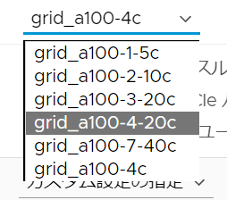

# MIG（Multi Instance GPU）
NVIDIA Ampare世代のGPUからMIG（Multi Instance GPU）の機能（いわゆる物理パーティショニング機能）が利用可能になり、より有効的にGPUを利用することが可能となりました。
下記にその利用手順をまとめてみます。

## 改訂履歴

| バージョン | 日付 | 改訂者 |
| :---: | :---: | :---: |
| 0.1 | 2022.9.16 | [Yoshihiko Katayama @HPE Japan Presales](yoshihiko.katayama@hpe.com) |
|  |  |  |

## MIGの有効化
MIGの有効化手順について、流れを記載しておきます。

MIG対応GPUホストにアクセス。
```
[root@localhost:~] nvidia-smi
Wed Aug 10 01:38:51 2022
+-----------------------------------------------------------------------------+
| NVIDIA-SMI 510.47.03    Driver Version: 510.47.03    CUDA Version: N/A      |
|-------------------------------+----------------------+----------------------+
| GPU  Name        Persistence-M| Bus-Id        Disp.A | Volatile Uncorr. ECC |
| Fan  Temp  Perf  Pwr:Usage/Cap|         Memory-Usage | GPU-Util  Compute M. |
|                               |                      |               MIG M. |
|===============================+======================+======================|
|   0  NVIDIA A100-PCI...  On   | 00000000:0F:00.0 Off |                    0 |
| N/A   44C    P0    41W / 250W |      0MiB / 40960MiB |      0%      Default |
|                               |                      |             Disabled |
+-------------------------------+----------------------+----------------------+

+-----------------------------------------------------------------------------+
| Processes:                                                                  |
|  GPU   GI   CI        PID   Type   Process name                  GPU Memory |
|        ID   ID                                                   Usage      |
|=============================================================================|
|  No running processes found                                                 |
+-----------------------------------------------------------------------------+
```
A100 GPUが搭載されていることがわかります。
0がGPU ID、複数枚搭載していれば1、2と増えて別のGPUも見えるみたいです。

MIG機能の有効化、-iの後はGPU IDを指定します。
```
[root@localhost:~] nvidia-smi -i 0 -mig 1
Warning: MIG mode is in pending enable state for GPU 00000000:0F:00.0:Not Suppor                                                                             ted
Reboot the system or try nvidia-smi --gpu-reset to make MIG mode effective on GP                                                                             U 00000000:0F:00.0
All done.
```

ESXiホストの再起動
```
[root@localhost:~] nvidia-smi -i 0 --query-gpu=pci.bus_id,mig.mode.current --format=csv
pci.bus_id, mig.mode.current
00000000:0F:00.0, Enabled
```

```
[root@localhost:~] nvidia-smi mig -lgip
+-----------------------------------------------------------------------------+
| GPU instance profiles:                                                      |
| GPU   Name             ID    Instances   Memory     P2P    SM    DEC   ENC  |
|                              Free/Total   GiB              CE    JPEG  OFA  |
|=============================================================================|
|   0  MIG 1g.5gb        19     0/7        4.75       No     14     0     0   |
|                                                             1     0     0   |
+-----------------------------------------------------------------------------+
|   0  MIG 1g.5gb+me     20     0/1        4.75       No     14     1     0   |
|                                                             1     1     1   |
+-----------------------------------------------------------------------------+
|   0  MIG 2g.10gb       14     0/3        9.75       No     28     1     0   |
|                                                             2     0     0   |
+-----------------------------------------------------------------------------+
|   0  MIG 3g.20gb        9     0/2        19.62      No     42     2     0   |
|                                                             3     0     0   |
+-----------------------------------------------------------------------------+
|   0  MIG 4g.20gb        5     0/1        19.62      No     56     2     0   |
|                                                             4     0     0   |
+-----------------------------------------------------------------------------+
|   0  MIG 7g.40gb        0     0/1        39.50      No     98     5     0   |
|                                                             7     1     1   |
+-----------------------------------------------------------------------------+
```

```
[root@localhost:~] nvidia-smi mig -cgi 9,19,14,19
Successfully created GPU instance ID  1 on GPU  0 using profile MIG 3g.20gb (ID  9)
Successfully created GPU instance ID 11 on GPU  0 using profile MIG 1g.5gb (ID 19)
Successfully created GPU instance ID  6 on GPU  0 using profile MIG 2g.10gb (ID 14)
Successfully created GPU instance ID 12 on GPU  0 using profile MIG 1g.5gb (ID 19)
```
```
[root@localhost:~] nvidia-smi mig -lgi
+-------------------------------------------------------+
| GPU instances:                                        |
| GPU   Name             Profile  Instance   Placement  |
|                          ID       ID       Start:Size |
|=======================================================|
|   0  MIG 1g.5gb          19       11          0:1     |
+-------------------------------------------------------+
|   0  MIG 1g.5gb          19       12          1:1     |
+-------------------------------------------------------+
|   0  MIG 2g.10gb         14        6          2:2     |
+-------------------------------------------------------+
|   0  MIG 3g.20gb          9        1          4:4     |
+-------------------------------------------------------+
```

```
[root@localhost:~] nvidia-smi mig -gi 11 -cci 0
Successfully created compute instance ID  0 on GPU  0 GPU instance ID 11 using profile MIG 1g.5gb (ID  0)
```
```
[root@localhost:~] nvidia-smi mig -gi 11 -lci
+--------------------------------------------------------------------+
| Compute instances:                                                 |
| GPU     GPU       Name             Profile   Instance   Placement  |
|       Instance                       ID        ID       Start:Size |
|         ID                                                         |
|====================================================================|
|   0     11       MIG 1g.5gb           0         0          0:1     |
+--------------------------------------------------------------------+
```

```
[root@localhost:~] nvidia-smi -L
GPU 0: NVIDIA A100-PCIE-40GB (UUID: GPU-14ac2834-0d81-0508-69eb-e25264c08d21)
  MIG 1g.5gb      Device  0: (UUID: MIG-b6cd45f2-9655-5269-9b96-65446729d5dc)
```

```
[root@localhost:~] nvidia-smi
Wed Aug 10 08:08:08 2022
+-----------------------------------------------------------------------------+
| NVIDIA-SMI 510.47.03    Driver Version: 510.47.03    CUDA Version: N/A      |
|-------------------------------+----------------------+----------------------+
| GPU  Name        Persistence-M| Bus-Id        Disp.A | Volatile Uncorr. ECC |
| Fan  Temp  Perf  Pwr:Usage/Cap|         Memory-Usage | GPU-Util  Compute M. |
|                               |                      |               MIG M. |
|===============================+======================+======================|
|   0  NVIDIA A100-PCI...  On   | 00000000:0F:00.0 Off |                   On |
| N/A   58C    P0   110W / 250W |      0MiB / 40960MiB |     N/A      Default |
|                               |                      |              Enabled |
+-------------------------------+----------------------+----------------------+

+-----------------------------------------------------------------------------+
| MIG devices:                                                                |
+------------------+----------------------+-----------+-----------------------+
| GPU  GI  CI  MIG |         Memory-Usage |        Vol|         Shared        |
|      ID  ID  Dev |           BAR1-Usage | SM     Unc| CE  ENC  DEC  OFA  JPG|
|                  |                      |        ECC|                       |
|==================+======================+===========+=======================|
|  0   11   0   0  |      0MiB /  4864MiB | 14      0 |  1   0    0    0    0 |
|                  |      0MiB /  8191MiB |           |                       |
+------------------+----------------------+-----------+-----------------------+

+-----------------------------------------------------------------------------+
| Processes:                                                                  |
|  GPU   GI   CI        PID   Type   Process name                  GPU Memory |
|        ID   ID                                                   Usage      |
|=============================================================================|
|  No running processes found                                                 |
+-----------------------------------------------------------------------------+
```

```
[root@localhost:~] nvidia-smi mig -gi 12 -lci
No compute instances found: Not Found
```

```
[root@localhost:~] nvidia-smi mig -gi 12 -cci 0
Successfully created compute instance ID  0 on GPU  0 GPU instance ID 12 using profile MIG 1g.5gb (ID  0)
```

```
[root@localhost:~] nvidia-smi mig -gi 12 -lci
+--------------------------------------------------------------------+
| Compute instances:                                                 |
| GPU     GPU       Name             Profile   Instance   Placement  |
|       Instance                       ID        ID       Start:Size |
|         ID                                                         |
|====================================================================|
|   0     12       MIG 1g.5gb           0         0          0:1     |
+--------------------------------------------------------------------+
```

```
[root@localhost:~] nvidia-smi mig -i 0 -lci
+--------------------------------------------------------------------+
| Compute instances:                                                 |
| GPU     GPU       Name             Profile   Instance   Placement  |
|       Instance                       ID        ID       Start:Size |
|         ID                                                         |
|====================================================================|
|   0     11       MIG 1g.5gb           0         0          0:1     |
+--------------------------------------------------------------------+
|   0     12       MIG 1g.5gb           0         0          0:1     |
+--------------------------------------------------------------------+
```

```
[root@localhost:~] nvidia-smi mig -i 0 -lgi
+-------------------------------------------------------+
| GPU instances:                                        |
| GPU   Name             Profile  Instance   Placement  |
|                          ID       ID       Start:Size |
|=======================================================|
|   0  MIG 1g.5gb          19       11          0:1     |
+-------------------------------------------------------+
|   0  MIG 1g.5gb          19       12          1:1     |
+-------------------------------------------------------+
|   0  MIG 2g.10gb         14        6          2:2     |
+-------------------------------------------------------+
|   0  MIG 3g.20gb          9        1          4:4     |
+-------------------------------------------------------+
```

```
[root@localhost:~] nvidia-smi mig -gi 6 -cci 0
Successfully created compute instance ID  0 on GPU  0 GPU instance ID  6 using profile MIG 1c.2g.10gb (ID  0)
```

```
[root@localhost:~] nvidia-smi mig -gi 1 -cci 0
Successfully created compute instance ID  0 on GPU  0 GPU instance ID  1 using profile MIG 1c.3g.20gb (ID  0)
```

```
[root@localhost:~] nvidia-smi mig -i 0 -lci
+--------------------------------------------------------------------+
| Compute instances:                                                 |
| GPU     GPU       Name             Profile   Instance   Placement  |
|       Instance                       ID        ID       Start:Size |
|         ID                                                         |
|====================================================================|
|   0     11       MIG 1g.5gb           0         0          0:1     |
+--------------------------------------------------------------------+
|   0     12       MIG 1g.5gb           0         0          0:1     |
+--------------------------------------------------------------------+
|   0      6       MIG 1c.2g.10gb       0         0          0:1     |
+--------------------------------------------------------------------+
|   0      1       MIG 1c.3g.20gb       0         0          0:1     |
```




### 参考ドキュメント
NVIDIA AI Enterprise Document - MIGの有効化
[Enabling MIG Mode for a GPU：](https://docs.nvidia.com/ai-enterprise/2.0/user-guide/index.html#enabling-mig-mode-for-a-gpu)

### Tips

きちんと紐づけておかないと、helmやpodmanからNGCコンテナイメージの取得ができません。<br>
Ex.
```
docker login nvcr.io                                          
Authenticating with existing credentials...
Login Succeeded
```
と、NGCレポジトリ自体にはアクセスできるのですが、
```
$ helm repo add nvaie --username=$oauthtoken --password=<YOUR-NGC-API-key> https://helm.ngc.nvidia.com/nvaie
Error: looks like "https://helm.ngc.nvidia.com/nvaie" is not a valid chart repository or cannot be reached: failed to fetch https://helm.ngc.nvidia.com/nvaie/index.yaml : 401 Unauthorized
```
とUnauthorizedされず、コンテナイメージを取得することができません。

6.6 Manage Helm Charts Using the Helm CLI：
https://docs.nvidia.com/ngc/ngc-private-registry-user-guide/index.html#managing-helm-charts-using-helm-cli
